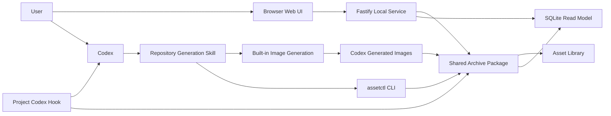
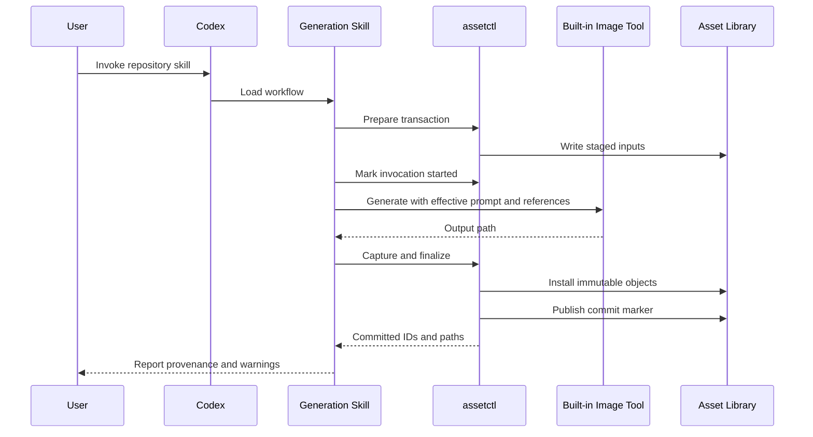

# 系统架构

## Context

系统由两条独立但共享同一 Asset Library contract 的执行路径组成:

- Codex Generation Workflow 负责生成和不可变归档.
- Local Web Application 负责查询、展示、Draft/Curation 和 recovery orchestration.

两条路径必须复用同一个 Archive package 和 JSON Schema. SQLite、Web API、Skill instructions 与 Hook 都不能成为第二事实来源.

## System Boundary



`CodexHome --> Archive` 表示 capture source, 不是 Archive package 主动扫描 `$CODEX_HOME`.

## Components

| Component                 | Owns                                                                                | Must Not Own                                                       |
| ------------------------- | ----------------------------------------------------------------------------------- | ------------------------------------------------------------------ |
| Browser Web UI            | UI state、URL state、unsubmitted form edits                                         | filesystem access、Archive write logic、generation invocation      |
| Fastify Local Service     | listener security、HTTP validation、orchestration                                   | domain duplicate、arbitrary file endpoint、authoritative user data |
| `assetctl`                | human/machine CLI、init、validate、commit、recover、migrate                         | independent Archive implementation                                 |
| Shared Archive Package    | filesystem contract、hash、lock、transaction、Commit Marker、Curation atomic update | HTTP、React、Codex prompt decisions                                |
| Read Model Package        | SQLite projection、FTS、query、thumbnail metadata                                   | non-rebuildable user data                                          |
| Generation Skill          | Prompt orchestration、tool sequence、user confirmation boundary                     | direct Archive file writes、API key fallback in MVP                |
| Built-in Image Generation | raster generation                                                                   | Library identity、commit、Curation                                 |
| Project Hook              | Codex guard 和 read-only validation                                                 | asset mutation、repair、business state                             |
| Asset Library             | authoritative runtime data                                                          | source code、global Codex config                                   |

## Runtime Topology

### Web Runtime

一个 local service process 打开一个 canonical Library root:

```text
Browser -> <configured-ip>:<port> -> Fastify -> Shared Packages -> Library
```

生产模式由 Fastify 托管 Vite static build. 开发模式可以由 Vite dev server 代理 `/api/v1`, 但最终 Host、Origin 与 token security behavior 必须在 production-like integration test 中验证.

服务启动顺序:

1. 解析 Library path.
2. 检查 `library.json` 是否存在.
3. 缺少 root 或 manifest 时跳过 read model, 进入 Library Unavailable control mode.
4. manifest 存在时验证 format 与 permissions.
5. 获取 read-only health snapshot.
6. 打开 SQLite read model; cache 缺失、损坏或 Commit Marker lag 时先重建.
7. 生成 session token 并绑定 configured host.
8. 对 wildcard bind 枚举 usable active interfaces, 建立 IP literal allowlist 并输出 concrete URLs. Scoped IPv6 link-local address 不发布为缺少 zone 的 URL.

Library Unavailable mode 不会创建 Library root、`.cache/`、SQLite index 或 fallback Library. Bootstrap 返回统一 `LIBRARY_UNAVAILABLE` state、reason 与 allowed actions. Static Web、bootstrap、health 和 Library transition control plane 保持可用, 其他 Library API 返回 `503 LIBRARY_UNAVAILABLE`. Library invalid 仍属于独立的 read-only diagnostics mode.

`npm start` 与 daemon 在创建 Server process 前构建 Web static artifact; build failure 不产生 listener. development runtime 直接使用 Vite, Server 与 Web 默认端口分别为 `4174` 与 `5173`, 两者从同一组 resolved environment values 得到.

### Daemon Runtime

daemon 是 project-owned detached Server, 不是 `launchd` 或 `systemd` service. 每个 Git checkout 只有一个实例, lifecycle state 位于 ignored `.runtime/daemon/`, 不属于 Asset Library:

```text
.runtime/daemon/
  metadata.json
  server.log
```

启动器使用唯一 process identity 创建 detached Node.js child, stdout 与 stderr 写入当前 `server.log`. Server 完成 Library Runtime、Fastify listener、security allowlist 与 concrete URL 解析后, 通过 parent-child IPC 发布 readiness. 启动器收到匹配 PID 的 typed message 后才原子发布 metadata 并返回成功; 60 秒超时或 child 提前退出时发送 `SIGTERM`, 不发布 metadata, 保留当次日志.

metadata 保存 PID、instance ID、启动时间、concrete URLs 与日志路径. status 在信号操作前同时核对 PID liveness 与唯一 process identity, 将缺失、有效或不匹配状态报告为 `stopped`、`running` 或 `stale`. stop 只向已验证实例发送 `SIGTERM`, 最多等待 10 秒; 超时后不升级为 `SIGKILL`, metadata 与日志保留用于诊断. 项目不提供自动重启、登录自启、named instances 或历史日志 rotation.

### Runtime Library Management

`LibraryRuntime` 是 active Archive adapter、Read Model、Library Service 与 Thumbnail Cache 的唯一所有者. 每个 Library data request 在入口获取 immutable context snapshot, 在 response 完成时释放. Request boundary 发现 root、manifest 或权限消失后, runtime 阻断新 data request 并进入 Library Unavailable; 外部恢复后仍要求显式 Retry.

Settings 显示 bootstrap 解析出的绝对 Library path, 并允许用户输入 Server 账号可访问的绝对目标路径. Server 不提供通用 filesystem directory listing 或文件读取 endpoint; Library transition 继续受 listener allowlist、Host、Origin、session token、canonicalization 与 OS permissions 约束.

同一时间只允许一个内存态 Library transition. Candidate 的 full validation 与 Index rebuild 在旧 Library 继续服务时完成. Candidate ready 后, commit boundary 拒绝新请求并排空旧请求, 再次校验 candidate, 原子持久化 `text-to-image.local.json`, 替换 active context 并轮换 session token. 其他 Browser tab 的旧 token 随即失效. 初始化已成功而后续步骤失败时保留新 Library, 但不改变旧 active context 或持久化选择.

### Generation Runtime



Built-in tool call 不经过 local Web service. Web service 通过 Commit Marker index update 观察新结果.

## Data Ownership

| Data                | Authoritative Owner         |        Mutable |          Indexed |
| ------------------- | --------------------------- | -------------: | ---------------: |
| `library.json`      | Asset Library control plane | migration only |              yes |
| Creation identity   | Archive                     |             no |              yes |
| Prompt Draft        | Creation working area       |            yes |              yes |
| Prompt Revision     | Archive                     |             no |              yes |
| Generation          | Archive                     |             no |              yes |
| Image Asset payload | Archive                     |             no |              yes |
| Commit Marker       | Archive                     |             no |              yes |
| Curation            | Curation tree               |            yes |              yes |
| Staging transaction | Transaction area            |            yes | diagnostics only |
| SQLite rows         | Read model                  |    rebuildable |             self |
| Thumbnail           | Cache                       |    rebuildable |               no |
| Browser theme       | Browser local preference    |            yes |               no |

## Write Paths

允许的写入入口:

```text
Web UI -> Fastify -> Shared Archive Package -> Draft/Curation/Recovery
Web UI -> Fastify Library Control Plane -> Init/Select/Retry
Codex Skill -> assetctl -> Shared Archive Package -> Archive Transaction
Human CLI -> assetctl -> Shared Archive Package -> Init/Select/Merge/Validate/Recovery
```

禁止的入口:

```text
Web UI -> generic filesystem read/write
Fastify handler -> managed path
Codex -> apply_patch Archive
Hook -> mutate Library
SQLite -> reconstruct Archive
```

## Read Paths

普通查询优先使用 SQLite read model. 权威 detail response 必须包含或核对 Archive source version. Diagnostics、validation 与 rebuild 直接遍历 Commit Marker 和 records.

Read model lag 允许在运行时发生, 但必须可观察. API health 返回 last indexed Marker、latest Archive Marker 和 lag count. Server 启动和 candidate preparation 都会重建 missing、corrupt 或 lagging read model. Web transition 可以热切换 root; CLI 修改 Library selection 或完成 Library Merge 后, 当前 process 仍需通过 Settings Retry/select 或重新启动以读取新 snapshot.

## Source Control and Runtime Data

Git 保存:

- TypeScript source.
- Codex Skill 与 project Hook.
- JSON Schema、fixtures 和 migration code.
- README、AGENTS、正式文档和 ADR.

Git 不保存:

- 用户 Asset Library.
- SQLite、thumbnail 和 test runtime artifacts.
- 本机 Library absolute path.
- `$CODEX_HOME/generated_images/...` output.

默认 `./library/` 被 root `.gitignore` 精确忽略. External Library 由 ignored local config 或 CLI 参数选择.

## Security Boundaries

### Browser to Local Service

- 默认绑定 `127.0.0.1`; explicit `--host` 可以选择具体 IPv4、IPv6、`0.0.0.0` 或 `::`.
- Wildcard bind 在启动时枚举 usable active interfaces, 只接受对应 IP literal 与实际 port; scoped IPv6 link-local address 与 DNS hostname 不进入 allowlist.
- exact Host/Origin.
- per-process session token.
- no wildcard CORS.
- CSP and content endpoint by hash.
- Non-loopback 模式只用于 trusted LAN, 不提供 TLS、额外身份认证或公网安全承诺.

### Local Service to Filesystem

- canonical root containment.
- no internal symlink.
- typed relative paths only.
- no arbitrary file endpoint.
- Archive writes only through shared package.

### Codex to Library

- AGENTS and Skill instructions.
- project-local trusted Hook.
- sandbox approval for external Library.
- writer and validator remain authoritative if Hook is bypassed.

### User Data

- Prompt 和图片默认不进入 logs.
- built-in generation 是唯一 MVP external processing path.
- app 不上传 Library、telemetry 或 thumbnails.

## Failure Domains

| Failure                          | Containment                           | Recovery                                   |
| -------------------------------- | ------------------------------------- | ------------------------------------------ |
| Image tool failure               | staging transaction                   | commit known failure Generation            |
| Codex interruption               | staging transaction                   | explicit interrupted recovery              |
| Archive commit crash             | uncommitted objects + Marker boundary | idempotent commit or quarantine            |
| SQLite corruption                | `.cache/`                             | delete and rebuild                         |
| Thumbnail corruption             | thumbnail cache                       | regenerate by hash/version                 |
| Curation conflict                | one sidecar                           | reload and optimistic retry                |
| Archive corruption               | read-only whole Library               | validate, diagnose, explicit repair design |
| External Library permission loss | current process                       | read-only/unavailable, no fallback Library |
| Library transition prepare       | candidate context                     | keep old context, report retryable failure |
| Library transition commit        | quiescent runtime boundary            | keep old selection unless persistence won  |
| Hook disabled                    | Codex guard only                      | writer still rejects invalid operations    |

## Compatibility

Compatibility dimensions独立版本化:

- Asset Library `formatVersion`.
- Per-record `schemaVersion`.
- HTTP API major version.
- CLI capabilities schema.
- Generation Skill supported format range.
- read model Schema, freely rebuildable.
- thumbnail transform version, freely rebuildable.

App 启动和 Skill prepare 都执行 capabilities handshake. Unsupported future version 必须 fail closed.

## Validation

- dependency rule lint 防止 apps 绕过 shared packages.
- API contract tests 确认 browser/server Schema 一致.
- end-to-end provenance test 跨 Browser、Server、Archive、Read Model 与 CLI.
- failure injection 确认每个 failure domain 不污染其他层.
- security suite 确认 local service 和 external Library path containment.
- integration suite 确认 request-boundary unavailable detection、single transition、drain、atomic persistence、runtime swap 与 session token rotation.
- docs checker 确认本总览 links 到 canonical detail, 不复制漂移的 Schema 定义.
