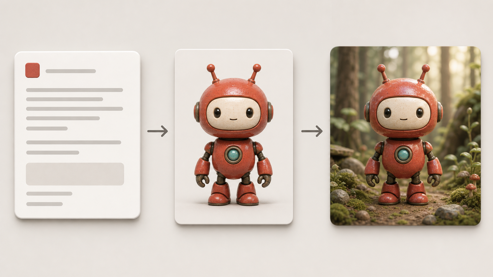
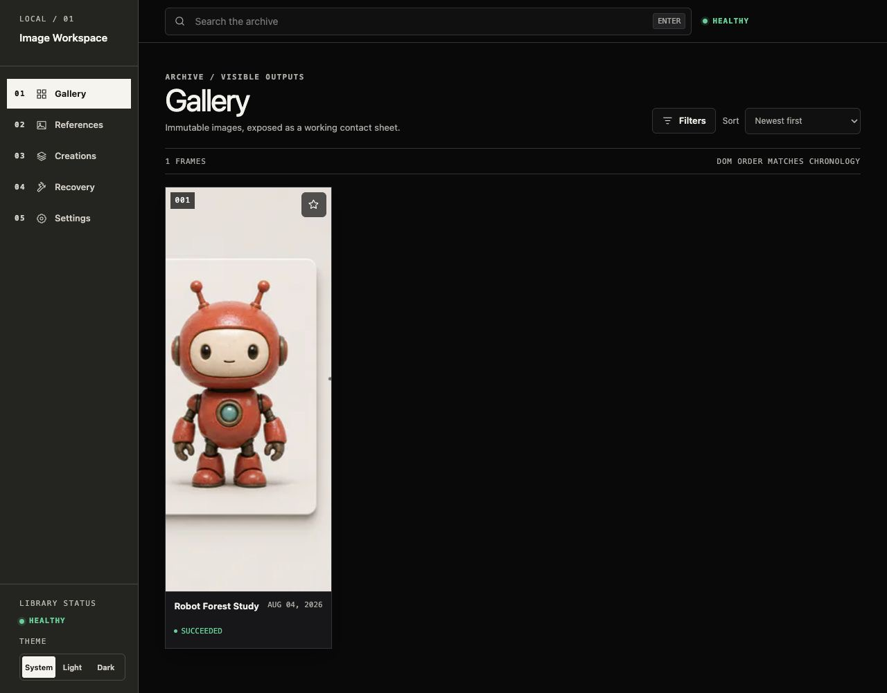
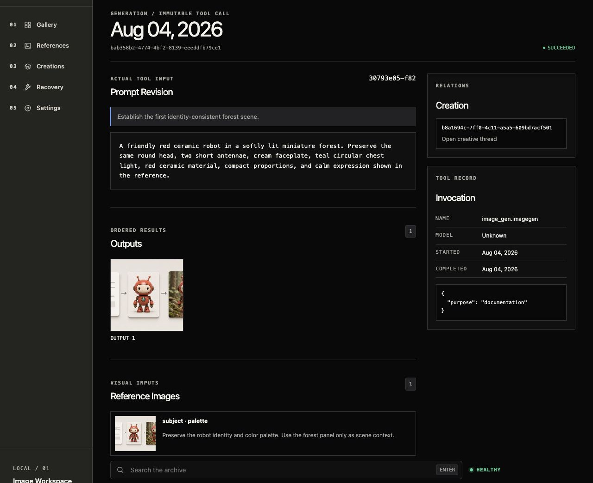
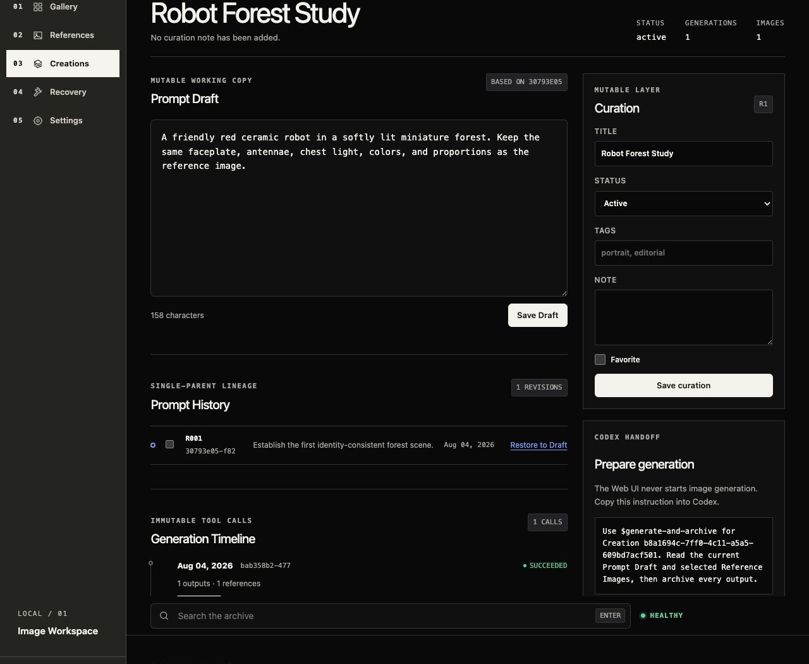

# 图片生成与整理用户手册

本手册面向第一次使用本项目的普通用户. 你不需要理解数据库、Schema 或归档事务. 日常使用时, 只需要在 Codex 中说明想生成什么, 并在 Web UI 中查看、比较和整理结果.

本手册覆盖以下任务:

- 从一段文字生成第一张图片.
- 使用人物、物品、风格、构图或配色色板作为参考图.
- 从同一个 Prompt 持续迭代, 比较不同版本, 并回到满意的历史版本.
- 在 Web UI 中查看结果、参考关系和生成记录.
- 正确处理附件路径、生成失败、安全拒绝和中断记录.

## 1. 先理解 4 个概念

日常操作会反复看到以下名称:

| 名称            | 可以把它理解为                              | 是否会被后续操作覆盖             |
| --------------- | ------------------------------------------- | -------------------------------- |
| Creation        | 一个长期创作项目, 例如 "红色机器人森林系列" | 不会. 它持续收纳同一主题的历史   |
| Prompt Draft    | 当前正在编辑的提示词草稿                    | 会. 你可以随时保存新内容         |
| Prompt Revision | 某次生成实际使用的提示词快照                | 不会. 每次生成都会留下可追溯版本 |
| Generation      | 一次真实的图片工具调用及其结果              | 不会. 成功、失败和中断都会保留   |

最重要的区别是: `Prompt Draft` 是工作稿, `Prompt Revision` 是已经使用过的历史快照. 修改 Draft 不会改写过去的图片和记录.



上图表示最常见的过程: 先写清楚目标, 再按需要提供参考图, 最后生成新图片. 中间和右侧的机器人保持同一身份, 但右侧加入了新的森林场景.

## 2. 使用前检查

### 2.1 已经能打开 Web UI

如果浏览器可以打开 Web UI, 且左下角 `Library status` 显示 `healthy`, 可以直接进入下一节.

开发模式的默认地址是 `http://127.0.0.1:5173`.

### 2.2 第一次在这台电脑上运行

第一次安装项目时需要 Node.js 24 和 npm. 如果你不负责安装环境, 可以把本节交给维护这个项目的人.

在项目目录中运行:

```bash
npm ci
npm run assetctl -- init --library ./library
npm run assetctl -- validate --library ./library --full
npm run dev
```

命令完成后, 打开 `http://127.0.0.1:5173`.

这些命令分别用于安装项目依赖、创建本地图片库、检查图片库完整性和启动 Web UI. 初始化只需要执行一次. 日后通常只需运行 `npm run dev`.

### 2.3 页面显示 Library unavailable

进入左侧 `Settings` 页面, 查看页面显示的 Library 绝对路径:

- 如果这是一个准备新建的空目录, 使用 `Initialize`.
- 如果目录中已经存在有效 Library, 使用 `Select`.
- 如果原来的磁盘或目录只是短暂不可用, 恢复后使用 `Retry`.

不要随意初始化一个本应包含旧数据的目录. `Initialize` 适用于 missing 或 empty target, 不能恢复已经删除的图片.

## 3. 第一次从文字生成图片

当前 Web UI 不会直接启动图片生成. 生成操作在 Codex 中进行, Web UI 用于编辑 Draft、复制生成指令、查看历史和整理结果.

### 3.1 创建一个 Creation

一个主题长期使用一个 Creation. 例如, 同一个角色在不同场景中的图片应保存在同一个 Creation 中, 不要每次都创建新项目.

在 Codex 中发送类似请求:

> 请在当前 Asset Library 中新建一个 Creation, 标题为 "红色机器人森林系列". Prompt Draft 为: 一个友好的红色陶瓷机器人, 圆头, 两根短天线, 奶油色面板, 胸前有青绿色圆形灯, 站在柔和晨光下的微缩森林中. 画面为横向 16:10, 安静、精致、具有轻微黏土质感.

Codex 创建完成后会返回 Creation ID. 以后可以直接用标题或 Creation ID 指代它.

### 3.2 明确调用生成 Skill

图片生成必须显式调用 `$generate-and-archive`. 最简单的请求是:

> 请使用 `$generate-and-archive` 为 Creation "红色机器人森林系列" 读取当前 Prompt Draft, 生成 1 张图片并归档全部结果.

Codex 会检查 Library 状态, 固定实际 Prompt, 调用图片生成工具, 检查输出并完成归档. 完成报告应包含 Creation、Revision、Generation、结果状态、图片路径、尺寸和 SHA-256.

### 3.3 查看结果

打开 Web UI 的 `Gallery` 页面. 最新生成结果默认显示在最前面.



在 Gallery 中可以:

- 点击缩略图打开图片详情.
- 使用星标收藏满意结果.
- 使用搜索查找标题、Prompt、标签或备注.
- 使用 `Filters` 筛选状态和收藏结果.
- 调整排序方式.

## 4. 如何写清楚一个 Prompt

一个稳定的 Prompt 不需要堆叠大量形容词. 推荐按以下顺序描述:

1. 主体是谁或是什么.
2. 不可改变的身份特征.
3. 正在做什么, 位于什么环境.
4. 构图、视角和画幅.
5. 风格、材质、色彩和光线.
6. 必须避免的内容.

可复制模板:

> 主体: [人物、角色、产品或场景]. 固定特征: [脸型、服装、颜色、材质、标志性结构]. 动作与环境: [动作、地点、时间]. 构图: [景别、机位、方向、画幅]. 视觉风格: [写实、插画、3D、线稿等]. 光线与色彩: [光线、主色、对比度]. 必须保持: [身份或设计一致性]. 避免: [不希望出现的内容].

示例:

> 一个友好的红色陶瓷机器人, 圆头, 两根短天线, 奶油色面板, 胸前有青绿色圆形灯, 身体比例紧凑. 它站在长满苔藓的微缩森林小径上, 清晨柔和散射光, 低机位全身视角, 横向 16:10. 高级编辑插画风格, 柔和 3D 黏土材质, 低饱和自然色. 严格保持机器人的头部轮廓、天线、面板、胸灯、颜色和比例. 避免文字、标志、水印、复杂道具和夸张姿势.

### 4.1 哪些信息最值得固定

对于人物或角色, 优先固定脸型、五官比例、发型、年龄印象、体型和服装. 对于产品, 优先固定轮廓、尺寸比例、材质、接口、按钮和品牌识别结构. 对于连续场景, 优先固定主体身份, 再改变环境、镜头或动作.

### 4.2 负面要求怎样写更有效

负面要求应直接对应风险. 例如角色一致性任务可以写 "避免脸型漂移、眼距改变、发型改变、年龄改变和服装变化". 不要加入与任务无关的几十项禁令, 过多约束可能互相冲突.

## 5. 使用参考图生成图片

参考图不是简单的 "让模型看看这张图". 你需要告诉 Codex 每张图负责什么. 一张图可以承担多个角色.

### 5.1 Reference role

| Role          | 适合表达                   | 示例说法                             |
| ------------- | -------------------------- | ------------------------------------ |
| `subject`     | 人物、角色、物品或产品身份 | "这张图只用于固定角色身份和服装"     |
| `style`       | 线条、渲染、材质和整体画风 | "沿用这张图的水彩笔触和纸张质感"     |
| `composition` | 镜头、构图、姿势和空间关系 | "只参考三分构图和低机位, 不参考人物" |
| `palette`     | 主色、辅色和明暗关系       | "沿用米白、砖红和墨绿配色"           |
| `other`       | 上述分类无法准确表达的用途 | 必须同时说明具体 guidance            |

如果你没有说明用途, Codex 不应自行猜测 Reference role, 而应先询问你.

### 5.2 推荐的可靠引入方式

会话中粘贴、拖入或附加的图片最初只是 `Session Image`. 它只有在原始文件已经存在于本机可读取路径, 并被导入当前 Library 后, 才会成为可追溯的 Reference Image.

推荐流程:

1. 把参考图保存在稳定的本地路径. 也可以先放入当前 Library 的 `inbox/` 目录.
2. 在请求中写出准确路径, 并说明每张图的 role 和 guidance.
3. 显式调用 `$generate-and-archive`.
4. Codex 会先检查全部图片, 再导入 Library, 最后开始生成.

示例:

> 请使用 `$generate-and-archive` 为 Creation "红色机器人森林系列" 生成 1 张新图片. 参考图位于 `/path/to/robot-reference.png`, role 为 `subject` 和 `palette`. 严格保持机器人的圆头、两根短天线、奶油色面板、青绿色胸灯、红色陶瓷材质和紧凑比例. 只把场景改为雨后的森林小径, 不改变角色身份.

多图示例:

> 请使用 `$generate-and-archive` 为当前 Creation 生成 1 张图片. `/path/to/character.png` 用作 `subject`, 只固定角色身份和服装. `/path/to/layout.jpg` 用作 `composition`, 只参考低机位和左右留白. `/path/to/colors.png` 用作 `palette`, 只参考砖红、墨绿和米白配色. 不要从构图图继承其中的人物.

### 5.3 为什么不能只依赖 Files mentioned

Codex 界面显示 `Files mentioned` 不等于项目已经获得了可归档的原始文件. 需要区分两种情况:

- 如果条目同时提供真实、可读取的本地绝对路径, Skill 可以检查并导入该文件.
- 如果宿主只提供不透明的会话附件标识, 没有原始 bytes 或本地路径, 项目无法建立长期可验证的 Reference relation, 会以 `SESSION_IMAGE_NOT_MATERIALIZED` 停止.

因此, 最稳妥的方法不是依赖附件在会话中 "看得见", 而是确保它具有稳定的本地路径, 并在请求中明确写出该路径. 这也能避免换任务、重启应用或稍后回看时丢失来源.

如果出现读取权限问题, Codex 应请求该文件的限定读取权限后重试一次. 权限拒绝不应被误报为文件不存在.

### 5.4 多张参考图的失败规则

生成开始前会先检查全部参考图. 任何一张缺失、不可读、格式不支持或损坏时, 本次 Generation 都不会开始, 也不会静默忽略失败图片. 已成功导入 Library 的资产会保留, 下次使用相同文件时按内容自动复用.

### 5.5 在 Generation 页面核对参考关系

点击 Creation 的 Generation Timeline 记录, 可以看到本次实际使用的 Prompt Revision、输出、Reference Images、role、guidance 和工具信息.



检查角色一致性问题时, 先确认 Reference Images 中是否确实存在目标图片, role 是否正确, guidance 是否明确. 只有图片出现在这里, 才表示它已经成为该次 Generation 的正式输入.

## 6. 基于一个 Prompt 持续迭代

Prompt 迭代的核心原则是: 保留稳定部分, 每次只改变一个主要变量, 并记录本次改变的意图.

### 6.1 在 Web UI 中修改 Draft

进入 `Creations`, 打开目标 Creation. 在 `Prompt Draft` 中修改当前工作稿, 然后点击 `Save Draft`.



页面中的主要区域:

- `Prompt Draft`: 当前可修改工作稿.
- `Prompt History`: 已经用于生成的不可变历史版本.
- `Generation Timeline`: 每一次真实调用及其状态和输出.
- `Curation`: 标题、状态、标签、备注和收藏.
- `Prepare generation`: 可复制到 Codex 的标准生成指令.

保存 Draft 只修改工作稿, 不会自动生成图片. 保存后, 点击 `Copy instruction`, 把指令粘贴到 Codex, 或直接明确调用 Skill.

### 6.2 使用 change instruction

不要每次重写整个 Prompt. 可以告诉 Codex 保留现有 Draft, 只做一项改变:

> 请使用 `$generate-and-archive` 为 Creation "红色机器人森林系列" 生成 1 张新图片. 保留当前 Prompt Draft 和角色身份, 本次 change instruction 只把时间从清晨改为雨后黄昏, 其他构图、材质和颜色不变.

推荐的一次一变量顺序:

1. 先确定主体身份和设计.
2. 再确定构图和镜头.
3. 再调整环境和动作.
4. 再调整光线和配色.
5. 最后微调材质、细节和负面要求.

这样可以知道结果变化来自哪一项修改. 如果同时改变角色、构图、画风和灯光, 即使结果更好, 也很难判断哪一条指令有效.

### 6.3 生成多个 variant

如果想比较多个随机结果, 可以要求多个 variant:

> 请使用 `$generate-and-archive` 为当前 Creation 生成 3 个 variant. 三次都使用相同 Prompt Revision 和相同 Reference Images, 每次都完整归档. 不要根据前一个结果自动修改 Prompt.

每个 variant 是独立 Generation. 工具不会把多次调用合并成一条记录, 也不会因为某张主观质量较差而丢弃它.

### 6.4 比较历史版本

在 `Prompt History` 中勾选两个 Revision, 页面会显示差异. 建议比较相邻版本, 并关注:

- 哪些身份约束被新增或删除.
- 构图、镜头或画幅是否改变.
- 风格词是否互相冲突.
- 负面要求是否过多.
- Reference guidance 是否与 Prompt 一致.

### 6.5 回到满意版本

在历史 Revision 旁点击 `Restore to Draft`. 该操作只把历史内容复制回当前 Draft, 不会删除后续 Revision 或 Generation. 恢复后仍需保存 Draft, 再显式发起新的 Generation.

### 6.6 Replay 和 retry

Replay 表示用相同的历史输入再执行一次, 但仍会创建新的 Generation. Retry 也不会覆盖失败记录. 系统不会自动重试, 因为自动调用可能增加成本, 也可能让未知结果重复生成.

可复制请求:

> 请使用 `$generate-and-archive` replay Generation `[generation-id]`. 保持原 Prompt Revision、Reference Images、roles 和 guidance 不变, 创建新的 Generation 并归档结果.

如果只想修正失败原因, 应先编辑 Draft 或参考图说明, 再发起一条新的 Generation, 不要要求改写旧记录.

## 7. 整理和筛选结果

### 7.1 收藏满意图片

在 Gallery 卡片上点击星标. 之后可以在 `Filters` 中启用 favorites only, 快速查看候选结果.

### 7.2 给 Creation 添加整理信息

在 Creation 右侧的 `Curation` 中可以编辑:

- `Title`: 易于搜索的项目名称.
- `Status`: `active` 表示正在使用, `shelved` 表示暂时搁置.
- `Tags`: 例如 `portrait`, `product`, `forest`, `warm-light`.
- `Note`: 记录选片理由、交付用途或下一步计划.
- `Favorite`: 标记重要 Creation.

建议不要在 Note 中记录密码、API key 或其他敏感信息.

### 7.3 沿 provenance 回看

从 Gallery 图片可以打开 Image 详情, 再进入产生它的 Generation, 最后回到 Creation. 这条关系能回答:

- 这张图由哪个 Prompt Revision 生成.
- 当时使用了哪些参考图.
- 每张参考图承担什么 role.
- 工具调用成功、失败还是中断.
- 同一 Creation 还有哪些前后版本.

## 8. 失败与恢复

### 8.1 failed

`failed` 表示工具明确失败, 且失败记录已经归档. 打开 Generation 页面查看摘要:

- 如果是输入或格式问题, 修正 Draft 或参考图后创建新 Generation.
- 如果是可重试的服务问题, 确认后显式 replay 或发起新 Generation.
- 如果是 safety rejection, 根据页面的类别级建议检查 Prompt, 不要假设某个具体词一定是原因.

输出阶段的 safety rejection 只说明生成结果被拒绝, 不等于可以断言用户 Prompt 违规.

### 8.2 interrupted

`interrupted` 表示工具调用已经开始, 但系统无法确认最终结果. 这时不要立即重复生成. 进入 `Recovery` 页面检查 staged transaction, 按页面提供的预览和动作处理.

### 8.3 Recovery 页面

Recovery 操作可能发布、取消或隔离事务. 先使用 dry-run 或预览确认目标, 再执行实际动作. 如果你不确定, 把页面中的 transaction ID 和状态发给 Codex, 要求它读取项目 Recovery 规则后给出建议.

### 8.4 Gallery 显示 Generation Issues

Gallery 顶部会显示 active Creation 的最新问题. 后续一次成功 Generation 会让该 Creation 的全局 Issue 消失, 但历史失败仍保留在 Creation Timeline 中. `shelved` Creation 不进入全局问题区域.

## 9. 常见问题

### Web UI 中为什么没有 Generate 按钮?

这是当前产品边界. Web UI 负责浏览和整理, Codex 负责显式调用图片工具与归档. 在 Creation 页面使用 `Copy instruction`, 然后把指令粘贴到 Codex.

### 为什么附件在对话里可见, 却不能作为参考图?

对话可见性和可归档性不是一回事. 项目需要可读取的原始文件路径或 bytes, 才能计算内容身份并长期保存 Reference relation. 请把图片保存到稳定路径并明确提供该路径.

### 可以直接修改已经生成的图片吗?

当前 `$generate-and-archive` 只支持 generate mode, 不支持 edit target、mask 或透明背景后处理. 你可以把旧图片作为新的 Reference Image, 明确 role 和要改变的内容, 生成一个新结果.

### 为什么差的结果也被保存?

为了保持完整历史, 每个真实输出都会归档. 主观质量由 Gallery 收藏、标签和备注处理, 不在归档阶段删除.

### 修改 Draft 会不会改变旧图片?

不会. 旧图片绑定的是不可变 Prompt Revision. Draft 只是当前工作稿.

### 同一个 Prompt 为什么会产生不同图片?

图片生成通常具有随机性. 如果需要公平比较, 明确要求相同 Prompt Revision、相同 Reference Images 和相同 guidance, 并把每次结果作为独立 variant.

### 可以同时更换 Library 吗?

一次生成开始后会固定当前 Library root. 不要在生成过程中切换 Library. 等本次 Generation 完成或进入明确 Recovery 状态后再切换.

## 10. 可复制的日常请求

### 纯文字生成

> 请使用 `$generate-and-archive` 为 Creation `[title-or-id]` 读取当前 Prompt Draft, 生成 1 张图片并归档全部结果. 如果需要改变主体、构图目标、用途或风格方向, 先向我确认.

### 单张角色参考图

> 请使用 `$generate-and-archive` 为 Creation `[title-or-id]` 生成 1 张图片. 参考图路径是 `[absolute-path]`, role 为 `subject`. 严格保持 `[identity-features]`. 本次只改变 `[one-change]`, 其他身份、比例、服装和基础风格不变.

### 多张参考图

> 请使用 `$generate-and-archive` 为 Creation `[title-or-id]` 生成 1 张图片. `[path-1]` 用作 `subject`, guidance 为 `[guidance-1]`. `[path-2]` 用作 `composition`, guidance 为 `[guidance-2]`. `[path-3]` 用作 `palette`, guidance 为 `[guidance-3]`. 不要在不同参考图之间混淆主体身份.

### 单变量迭代

> 请保持当前 Creation 的 Prompt Draft、角色身份和参考图不变. 使用 `$generate-and-archive` 创建一个新 Generation. 本次 change instruction 只调整 `[one-variable]`, 明确保持 `[stable-constraints]`.

### 多个 variant

> 请使用 `$generate-and-archive` 为当前 Creation 生成 `[count]` 个 variant. 每次使用相同 Prompt Revision、Reference Images、roles 和 guidance, 分别创建并归档独立 Generation, 不自动修改 Prompt, 不丢弃任何输出.

### 失败后的安全重试

> 请检查 Generation `[generation-id]` 的终态和 Recovery 状态. 不要自动重试. 如果结果明确 failed 且不存在未完成 transaction, 请说明失败原因和建议修改, 等我确认后再创建新的 Generation.

## 11. 一次完整操作的检查表

生成前:

- Creation 是否正确.
- Prompt Draft 是否描述主体、场景、构图、风格和避免项.
- 每张参考图是否有稳定路径.
- 每张参考图是否明确 role 和 guidance.
- 本次是新生成、variant、单变量迭代还是 replay.

生成后:

- 最终状态是否为 `succeeded`, `failed` 或 `interrupted`.
- 输出是否已经 committed, 而不仅是图片工具返回成功.
- Generation 页面是否显示正确 Prompt Revision 和 Reference Images.
- 角色、产品或风格的一致性是否满足目标.
- 是否需要收藏、添加标签或记录下一步变化.

只要坚持 "一个 Creation 管理一个长期主题, 一个 Revision 记录一次实际 Prompt, 一个 Generation 对应一次工具调用", 就可以安全地持续迭代, 又不会丢失历史和参考关系.
